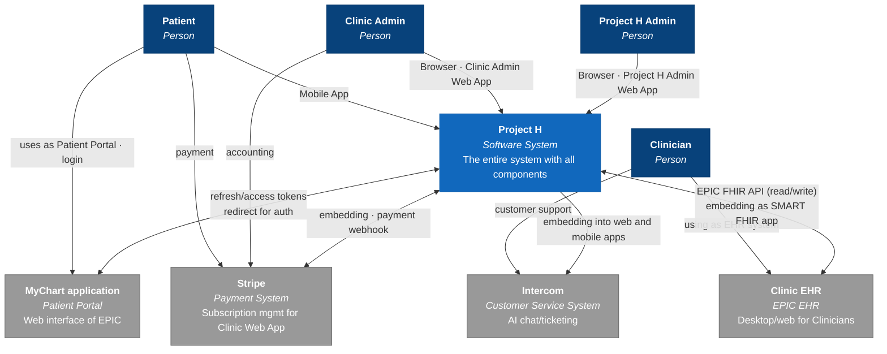
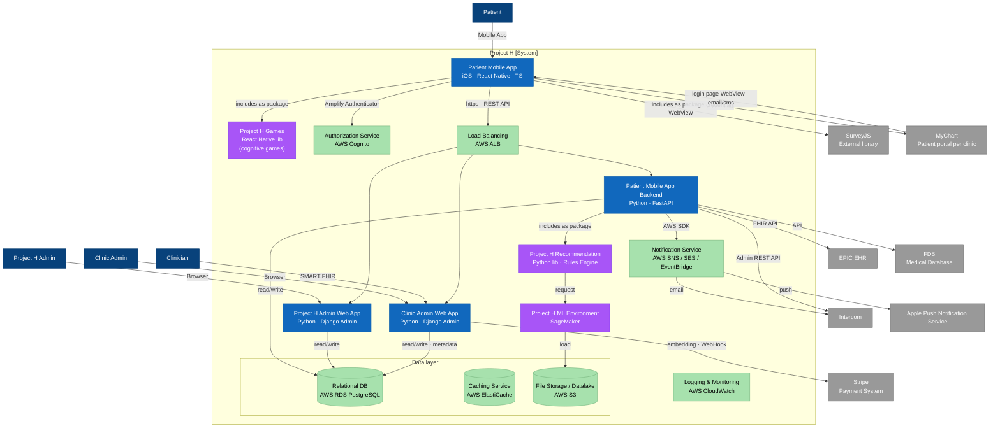
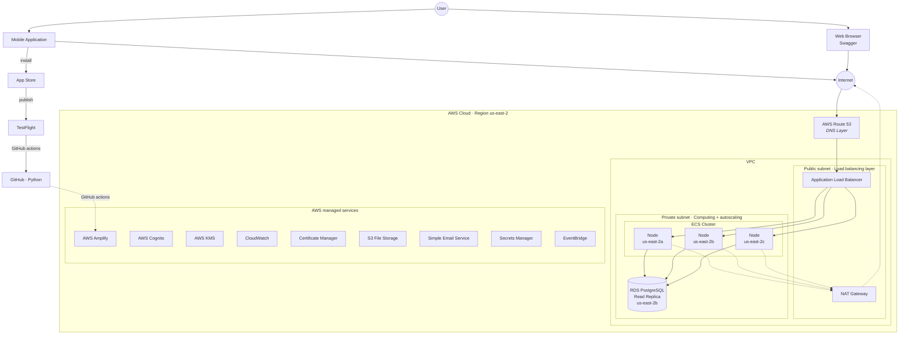
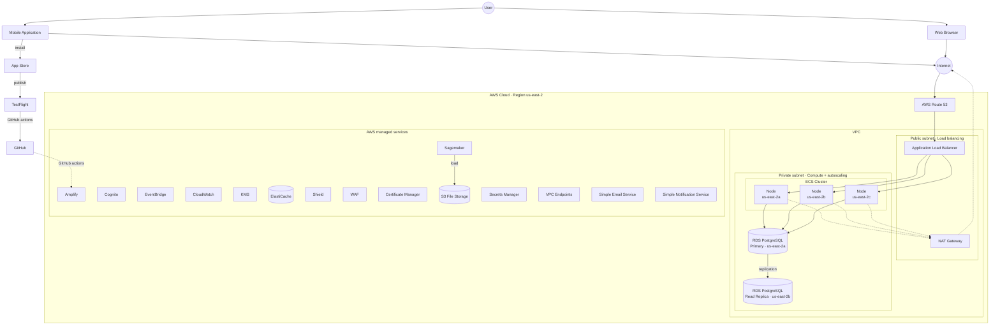
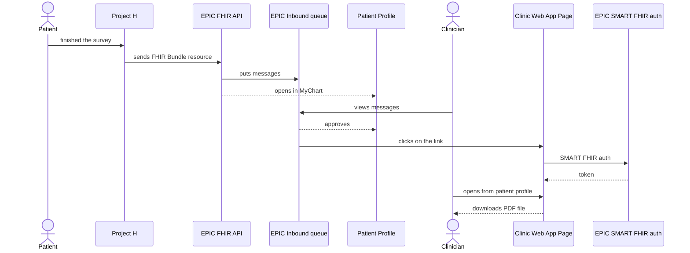
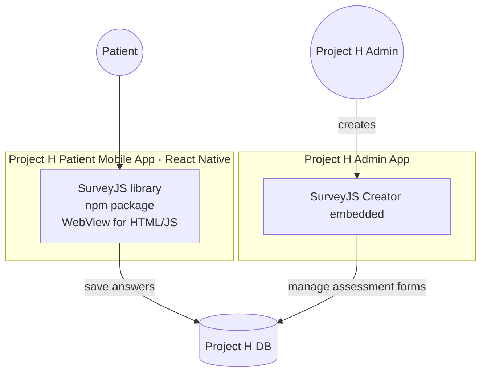

# Project H — Diagrams as Mermaid

All 9 active draw.io diagrams from the *Initial Phase Deliverables* subtree, converted to Mermaid. These render natively in GitHub, GitLab, MkDocs Material, Obsidian, VS Code preview, and most modern markdown viewers. Each block is a faithful restructuring of the original — captions/edge labels preserved, structural grouping kept via subgraphs.

> These are reconstructions from the rendered PNGs (since draw.io macro contents don't export through the Confluence markdown API). Verify against the originals (see `project-h-diagrams-index.md` for direct links) when accuracy matters for ADRs / sign-off.

---

## 1. Architect → User group associations

Multi-tenant data isolation (per-clinic namespaces + shared DB partitions + per-clinic EHR/MyChart).

```mermaid
flowchart TB
    P((Person<br/>email1, email2))

    subgraph C1["Clinic 1 namespace of apps"]
        P1[Patient User]
        CL1[Clinician User]
        PR1[Practice User]
    end

    subgraph C2["Clinic 2 namespace of apps"]
        P2[Patient User]
        CL2[Clinician User]
        PR2[Practice User]
    end

    subgraph AN["Admin namespace"]
        AU[Admin User]
    end

    subgraph DB[("Data")]
        D1[clinic 1 data]
        D2[clinic 2 data]
        DC[common and admin data]
    end

    EHR1[EHR/MyChart clinic1]
    EHR2[EHR/MyChart clinic2]

    P -- email1 --> P1
    P -- email1 --> CL1
    P -- email1 --> PR1
    P -- email2 --> P2
    P -- email2 --> CL2
    P -- email2 --> PR2
    P -- email1 --> AU

    P1 --> D1
    CL1 --> D1
    PR1 --> D1
    P2 --> D2
    CL2 --> D2
    PR2 --> D2
    AU --> DC

    D1 <--> EHR1
    D2 <--> EHR2
```

---

## 2. AVD 4.1 System Context View — `context`

C4 Level 1. Project H as central system + 4 persons + 4 external systems.



---

## 3. AVD 4.2 Container View — `container diagram`

C4 Level 2. Color legend: dark-blue = Person, blue = Andersen-implemented container, purple = Project H implemented, green = AWS managed, grey = external.



---

## 4. AVD 4.3 Deployment View — final product (`AdBoard`)

AWS topology (final product, full HW).



---

## 5. AVD 4.3 Deployment View — MVP1 (`MVP`)

Same skeleton as #4 plus Multi-AZ primary→read-replica replication and a larger managed-services rail (WAF, Shield, Sagemaker, ElastiCache, VPC Endpoints, SNS).



---

## 6. AVD 4.4 EPIC EHR Integration View — `flow`

Two-lane Patient/Clinician interaction; mapped to a sequence diagram for clarity.



---

## 7. AVD 4.5 Patient Authentication Flow — `login`

End-to-end onboarding/login with all decision branches (EPIC vs non-EPIC, first-time vs refresh, biometric setup).

```mermaid
flowchart TD
    Start([Patient clicks link in chat/email/sms]) --> P4["4. Special public page<br/>in Clinic App"]
    Start -. "or opens installed app" .-> P6
    P4 --> D1{Is Mobile App<br/>installed?}
    D1 -- No --> P5["5. App Store / Google Play"]
    P5 -- "download/install<br/>w/ clinicid+patientid" --> P6
    D1 -- Yes --> P6["6. Mobile App Initial page"]

    P6 --> D2{Is the first login?}
    D2 -- No --> P18["18. Refresh token<br/>validation component"]
    D2 -- Yes --> P7["7. Welcome page"]
    P7 --> P7a["7a. Consent Page"]
    P7a --> D3{Deep link<br/>contains code?}
    D3 -- No --> P9["9. Input backup code page"]
    P9 --> P10
    D3 -- Yes --> P10["10. Backend Code<br/>validation endpoint"]

    P10 --> D4{Is EPIC flow?}
    D4 -- No --> P10a["10a. Create Cognito user<br/>via Admin API"]
    D4 -- Yes --> P10b["10b. Insert data in patient table<br/>(email/epic_code as unique id)"]
    P10b --> P10c["10c. Mark code as USED"]
    P10c --> P10d["10d. Insert patient consents"]
    P10a --> D5{Is EPIC flow?}
    P10d --> D5
    D5 -- Yes --> P11A["11. MyChart Login page<br/>of specific clinic"]
    P11A --> P12A["12. MyChart MFA / consents"]
    D5 -- No --> P11B["11. Amplify Cognito Login"]
    P11B --> P12B["12. Cognito MFA"]
    P12A --> P15
    P12B --> P15["15. Post Login component"]

    P15 --> P15a["15a. Send refresh/access tokens<br/>to backend"]
    P15a --> D6{Is EPIC flow?}
    D6 -- Yes --> P15b["15b. Get Patient profile<br/>from EPIC"]
    P15b --> P15c["15c. Update patient record<br/>with name, address..."]
    P15c --> P15d["15d. Create and prefill<br/>onboarding assessment"]
    P15d --> D7
    D6 -- No --> D7{Is Biometric<br/>Access set?}

    D7 -- Yes --> P17["17. Default mobile dashboard"]
    D7 -- No --> P16["16. Set Up biometric page"]
    P16 --> D8{Skip setup?}
    D8 -- Yes --> P17
    D8 -- No --> P16a["16a. Biometric configuration"]
    P16a --> P17

    P18 --> D9{Biometric access<br/>configured?}
    D9 -- Yes --> P20["20. Biometric authentication"]
    P20 --> D10{User<br/>authenticated?}
    D10 -- Yes --> P21["21. Read and validate<br/>token component"]
    P21 --> D11{Refresh token<br/>valid?}
    D11 -- Yes --> P22["22. Get new access/refresh<br/>from MyChart or Cognito"]
    P22 --> P22a["22a. Store in secure storage"]
    P22a --> P17
    D11 -- No --> P11A
    D9 -- No --> P11A
    D10 -- No --> P11A
```



---

## 8. AVD 4.5 — `other users` (setup + EPIC / non-EPIC paths)

Admin setup (top), EPIC-user link-generation flow (middle), non-EPIC fallback (bottom).

```mermaid
flowchart TB
    subgraph Setup["Setup / Provisioning"]
        KAD((Project H Admin))
        EHRAD((EHR Admin))
        LGS[Clinic Web App<br/>Link Generation Service]
        PMA[Patient Mobile App]

        KAD -- "registers in Epic Orchard App Store" --> LGS
        EHRAD -- "create custom Action linking to LGS page" --> LGS
        EHRAD -- "configure MyChart as SSO permissions" --> PMA
        LGS --> PMA
    end

    subgraph EPICflow["EPIC User flow"]
        EPU((EPIC User))
        E1[1. Epic EHR<br/>Hyperspace / Hyperdrive]
        E2[2. Patient profile page<br/>with custom Action]
        E3[3. Modal: generated link<br/>+ backup codes]
        E3a[3a. Client Web App page]
        E3b[3b. Backend endpoint<br/>generate link/codes]
        EMC[3. MyChart communication<br/>Email, SMS]

        EPU -- logins --> E1
        E1 -- opens --> E2
        E2 -- "clicks on Action" --> E3
        E3 -- "requests as embedded component" --> E3a
        E3a -- requests --> E3b
        E3 -- "copies and inserts into" --> EMC
    end

    subgraph NonEPIC["non-EPIC User flow"]
        NEU((non-EPIC User))
        NE1[1. External system<br/>integrated with backend]
        NE2[2. Link parameters pages]
        NE3[3. ClinicAdmin non-epic endpoint<br/>generate link/codes]

        NEU -- opens --> NE1
        NE1 -- opens --> NE2
        NE2 -- submits --> NE3
    end
```



---

## 9. AVD 4.6 Assessment / Form Implementation — `surveys`

SurveyJS embedding split between patient (renderer) and admin (creator) sides.



---

## How to render / edit

- **GitHub / GitLab / MkDocs Material**: paste any block into a markdown file and it renders.
- **Live editor**: <https://mermaid.live> — paste, edit, export SVG/PNG.
- **VS Code**: install "Markdown Preview Mermaid Support" or "Mermaid Editor" extensions.
- **CLI**: `npm i -g @mermaid-js/mermaid-cli && mmdc -i diagrams.md -o diagrams.pdf`
