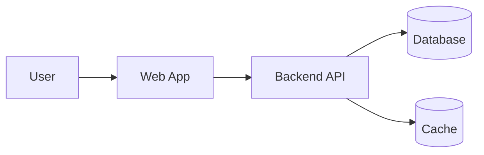

# Architecture

!!! warning "Placeholder"
    This section will be filled in from the Architecture Vision Document once the project sources are reviewed.

## Overview

A high-level description of the solution will live here: context, key components, and data flows.

## Context diagram

## Key decisions

| # | Decision | Rationale | Alternatives considered |
|---|----------|-----------|--------------------------|
| 1 | TBD | TBD | TBD |
| 2 | TBD | TBD | TBD |

## Non-functional requirements

- **Performance** — TBD
- **Scalability** — TBD
- **Reliability** — TBD
- **Security** — TBD

## References

- Architecture Vision Document (PDF) — to be added under `docs/assets/`
- Architecture Decision Records (ADRs) — to be added separately
