# Data flow — Patient onboarding

The end-to-end onboarding flow: clinician generates an invite in EPIC, patient receives it, app validates, MyChart OAuth completes, biometric is set up, dashboard is shown. The single most critical flow in the system — it gates every subsequent patient interaction.

## Trigger

Clinician generates an invite in EPIC via the Project H Custom Action button on the Patient profile page (or a Clinic Admin generates it from the Clinic Web App for a non-EPIC clinic). The invite consists of a Universal Link + a 6-character backup code. The clinician delivers both to the patient via EPIC channels (SMS, email, MyChart chat).

## Flow

```mermaid
%%{init: {'themeCSS': '.nodeLabel p,.nodeLabel span,.nodeLabel b,.nodeLabel i{color:#f8fafc !important;} .edgeLabel,.edgeLabel p,.edgeLabel span,.edgeLabel foreignObject div{color:#0f172a !important;} .edgeLabel foreignObject div{background:#ffffff !important;border-radius:2px;padding:1px 3px;} .labelBkg{fill:#ffffff !important;}'}}%%
flowchart TD
    Start([Patient clicks link in chat/email/sms]) --> P4["4. Special public page<br/>in Clinic App"]
    Start -. "or opens installed app" .-> P6
    P4 --> D1{Is Mobile App<br/>installed?}
    D1 -- No --> P5["5. App Store / Google Play"]
    P5 -- "download/install<br/>w/ clinicid+patientid" --> P6
    D1 -- Yes --> P6["6. Mobile App Initial page"]

    P6 --> D2{Is the first login?}
    D2 -- No --> P18["18. Refresh token<br/>validation component"]
    D2 -- Yes --> P7["7. Welcome page"]
    P7 --> P7a["7a. Consent Page"]
    P7a --> D3{Deep link<br/>contains code?}
    D3 -- No --> P9["9. Input backup code page"]
    P9 --> P10
    D3 -- Yes --> P10["10. Backend Code<br/>validation endpoint"]

    P10 --> D4{Is EPIC flow?}
    D4 -- No --> P10a["10a. Create Cognito user<br/>via Admin API"]
    D4 -- Yes --> P10b["10b. Insert data in patient table<br/>(email/epic_code as unique id)"]
    P10b --> P10c["10c. Mark code as USED"]
    P10c --> P10d["10d. Insert patient consents"]
    P10a --> D5{Is EPIC flow?}
    P10d --> D5
    D5 -- Yes --> P11A["11. MyChart Login page<br/>of specific clinic"]
    P11A --> P12A["12. MyChart MFA / consents"]
    D5 -- No --> P11B["11. Amplify Cognito Login"]
    P11B --> P12B["12. Cognito MFA"]
    P12A --> P15
    P12B --> P15["15. Post Login component"]

    P15 --> P15a["15a. Send refresh/access tokens<br/>to backend"]
    P15a --> D6{Is EPIC flow?}
    D6 -- Yes --> P15b["15b. Get Patient profile<br/>from EPIC"]
    P15b --> P15c["15c. Update patient record<br/>with name, address..."]
    P15c --> P15d["15d. Create and prefill<br/>onboarding assessment"]
    P15d --> D7
    D6 -- No --> D7{Is Biometric<br/>Access set?}

    D7 -- Yes --> P17["17. Default mobile dashboard"]
    D7 -- No --> P16["16. Set Up biometric page"]
    P16 --> D8{Skip setup?}
    D8 -- Yes --> P17
    D8 -- No --> P16a["16a. Biometric configuration"]
    P16a --> P17

    P18 --> D9{Biometric access<br/>configured?}
    D9 -- Yes --> P20["20. Biometric authentication"]
    P20 --> D10{User<br/>authenticated?}
    D10 -- Yes --> P21["21. Read and validate<br/>token component"]
    P21 --> D11{Refresh token<br/>valid?}
    D11 -- Yes --> P22["22. Get new access/refresh<br/>from MyChart or Cognito"]
    P22 --> P22a["22a. Store in secure storage"]
    P22a --> P17
    D11 -- No --> P11A
    D9 -- No --> P11A
    D10 -- No --> P11A
```

## Step-by-step prose (the 22-step flow)

This narration cross-links each step to the source user-story IDs. For brevity, sub-steps share the parent narrative.

**Steps 4–6 — Entry.** Patient taps the invite link. If the Project H app is installed (Universal Link triggers), the app opens directly; otherwise the link routes to a special public page in the Clinic App (step 4) that redirects to the App Store and re-triggers the link post-install. See US-1.3 (page `425558356`).

**Step 7 — Welcome.** First-time launch shows the 3-screen onboarding carousel (Privacy by design / Clinical AI precision / Human-centered care). Subsequent launches skip it. See US-1.1 (page `425558328`).

**Step 7a — Consents.** Patient reviews and accepts mandatory consents (HIPAA, EHR access, sharing with clinician, R&D de-identified data, emergency notifications). Consents are stored with patient ID + timestamp + version. Subsequent launches skip if already collected. See US-1.2 (page `425558346`).

**Steps 8–10 — Invite/backup-code validation.** If the deep link carries an invite token, the app calls the backend code-validation endpoint directly. If the link is invalid or absent, the patient enters the 6-character backup code on a dedicated screen (step 9). The backend validates: token exists in DB, not expired, not already used. See US-1.4 (page `425558359`).

**Steps 10a–10d — Patient table seeding.** EPIC flow: insert the patient row with `epic_patient_id` or the code as unique identifier; mark code USED; insert consent records. Non-EPIC flow: create a Cognito user via Admin API instead. See AVD §2.2 D3 (page `420911663`).

**Steps 11–12 — MyChart / Cognito login.** EPIC flow: embedded MyChart login page for the specific clinic, followed by MFA / consent prompts if configured. Non-EPIC flow: Amplify Cognito login page + Cognito MFA. See US-1.5 (page `425558367`).

**Steps 15–15d — Post-login.** Backend receives the tokens and stores them encrypted (D9). For EPIC patients, the Patient profile data is pulled from EPIC FHIR and used to prefill the intake questionnaire (step 15d). Pulled fields: demographics (DOB, gender, race, language, marital status, education, children, height) + allergies + current medications + comorbidities. See US-1.1 of Epic-2 (page `425558452`) and [patient-profile schema](../../schema/tables/patient-profile.md).

**Steps 16–16a — Biometric setup.** Patient is prompted to set up Face ID or a 4–6-digit passcode. "Set Up Later" is allowed *once*; on the next login the setup screen returns and is mandatory. See US-1.6 (page `425558414`).

**Step 17 — Dashboard.** Lands on the Project H home with intake / screener / follow-up tasks visible.

**Steps 18–22a — Returning login.** On subsequent app opens, the app validates the refresh token. If still valid and biometric is configured, prompt for Face ID / passcode; on success, request fresh access + refresh tokens via the backend's refresh endpoint. If the refresh token is invalid, fall back to full MyChart / Cognito re-auth.

## Critical invariants

1. **Consents are stored before any MyChart authentication is invoked.** This is what makes the onboarding HIPAA-aligned — the patient has explicitly consented to EHR access before EPIC sees them. See [BR-002](../../modules/auth-authorization/business-rules.md) for the rule that codifies this.
2. **Access and refresh tokens are encrypted on device AND on backend** (D9). The device-side secret store uses Secure Enclave on iOS.
3. **On any auth failure**, no PHI is exposed. The app falls back cleanly to the login screen — no partial UI, no "stuck on a half-rendered dashboard".
4. **The per-clinic MyChart URL must be resolvable** even if local storage is cleared. The current behaviour: the URL is saved on first successful login; on subsequent failures, the backend re-derives it from the patient record via `epic_patient_id`. See the open question below.

## Cross-references

- [Auth & Authorization module overview](../../modules/auth-authorization/overview.md) — same flow from the module-API perspective.
- [Business rules](../../modules/auth-authorization/business-rules.md) — BR-001 through BR-010 codify the invariants the flow depends on.
- [ADR-0001](../decisions/0001-mychart-as-per-clinic-sso.md) — the MyChart-as-SSO decision that this flow operationalises.
- [Integration points](../integration-points.md) — EPIC EHR + MyChart contract.

> [!warning]
> Diagram complexity: this flowchart has 14 decision points and pushes Mermaid's readability limit. In a real engagement, escalating to PlantUML for this specific flow may improve clarity. The diagram-tool decision rule in [CONVENTIONS](../../CONVENTIONS.md) defines the threshold; this flow sits on the edge.

## Open questions

- **MyChart URL resolution after local-storage wipe and concurrent refresh-token failure.** Current behaviour relies on the backend lookup via `epic_patient_id`; if that itself requires a refresh-token-authenticated call, we have a chicken-and-egg condition. *Owner:* Tech Lead. *Outcome:* design spike in week 1.
- **Invite-link expiration policy surfaced to the clinician.** The clinician generating an invite does not see how long it is valid for (the backend has a default, but the EPIC modal doesn't display it). *Owner:* UX + Architect. *Outcome:* UI iteration in implementation.
- **What happens if the patient profile fetch fails partially** (some FHIR resources retrieved, others timed out)? Current spec says "missing/partial data does not block flow"; the user-facing UX of that is unclear. *Owner:* UX + Tech Lead. *Outcome:* edge-case test in QA.
