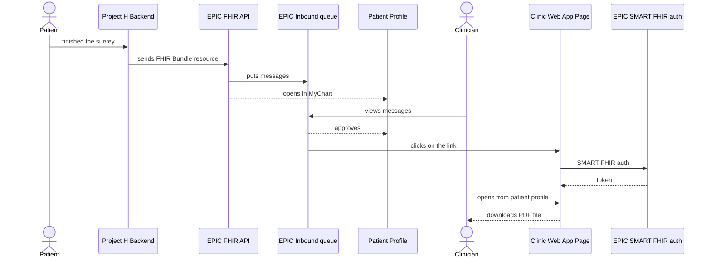

# Data flow — Report to clinician

How a completed intake / screener becomes a clinician-facing PDF inside EPIC. The flow ties together intake answers, FDB-coded patient profile, the Project H recommendation library, FHIR resource assembly, and the EPIC inbound-queue notification mechanism.

## Trigger

Patient completes Intake + Screener (or, in 2nd release onward, completes a follow-up questionnaire or a cognitive game session). On completion, the Patient Mobile App posts the answer-set to the Patient Mobile App Backend.

## Flow

## Step-by-step prose

1. **Assemble the patient profile.** The Patient Mobile App Backend composes the patient's data from three sources: the EPIC pull at first login (demographics + clinical history), the intake / screener answers just submitted, and the FDB-coded mapping for medications / conditions / allergies. The full shape of this composite is documented in [schema/tables/patient-profile.md](../../schema/tables/patient-profile.md).
2. **Invoke the recommendation library.** The Project H Recommendation Python library (D30, black-box from Andersen's side) takes the assembled profile + intake answers + (where available) cognitive-game results. It returns ranked diagnoses, treatment options with CPT codes attached, monitoring guidance, and references. See the [L3 view of the Backend](../overview.md#patient-mobile-app-backend-l3) — the **Recommendation Invoker** component owns this call.
3. **Generate the PDF.** The Report Assembler renders an HTML template provided by Project H (D8) with the recommendation outputs, then converts to PDF. The PDF is stored on S3 with a Project H–owned URL.
4. **Assemble the FHIR Bundle.** Three resources go into a `searchset` Bundle:
    - **Observation** — patient-reported assessment scores (LOINC-coded). Marked PGHD. **This resource is mandatory** — without it, the clinician notification does not fire.
    - **Condition** — provisional diagnostic concerns (ICD-10 / SNOMED-coded).
    - **DocumentReference** — pointer to the PDF on S3. The `content.url` is the SMART FHIR-gated download URL.
    All three are flagged as PGHD so EPIC routes them to the clinician's In Basket / Inbound Queue.
5. **Send the Bundle to EPIC FHIR API.** The FHIR Adapter (Backend L3) POSTs the Bundle via the patient's MyChart refresh token. EPIC accepts the resources, files them against the patient's record, and triggers the PGHD workflow.
6. **EPIC notifies the clinician.** The Inbound Queue places the message in the clinician's In Basket. The clinician views the message and either approves (the resources move to the patient profile permanently) or rejects.
7. **Clinician opens the report PDF.** From the patient profile or the In Basket message, the clinician clicks the `DocumentReference.content.url` link. The Clinic Web App Page intercepts the request, completes EPIC SMART FHIR authentication, verifies the clinician is authorised for that patient, and serves the PDF.
8. **Clinician finalises the diagnosis in EPIC.** After review, the clinician records a finalised diagnosis in EPIC's standard workflow (outside Project H's surface). On the patient's next login, Project H pulls back the finalised diagnosis via the EPIC FHIR API (Epic-3 F3 — page `425558444`) and updates the patient profile.

## Critical invariants

1. **Recommendations live only inside the PDF** (D23). The Bundle's structured resources carry only patient-reported facts, never recommendations. This is what keeps Project H inside Class I CDSS — see the [Architectural assessment](../overview.md#architectural-assessments) callout in the architecture overview.
2. **Patients cannot directly download the PDF.** The SMART FHIR auth gate on the Clinic Web App Page verifies the requester is a clinician authorised for that specific patient. Patient access is gated through HIPAA right-of-access requests, not automatic download.
3. **The Observation resource must be present in every Bundle.** Without it, the EPIC inbound-queue workflow doesn't trigger and the clinician will never see the report. This is non-obvious to a developer touching the Bundle assembly code for the first time.
4. **The PDF URL has a finite TTL.** Currently — TBD — to limit access window. See the open question below.

## Cross-references

- [Architecture overview — Backend L3](../overview.md#patient-mobile-app-backend-l3) — the components that orchestrate this flow.
- [Integration points — EPIC EHR / MyChart](../integration-points.md#epic-ehr--mychart) — the contract this flow depends on.
- [Architecture overview — CDSS Class I architectural assessment](../overview.md#architectural-assessments) — why the report shape matters beyond engineering.
- AVD 4.4 EPIC EHR Integration View (page `420906849`) and AVD 4.4.2 Outbound messages (page `420906856`) — the source diagrams.

## Open questions

- **DocumentReference URL TTL.** What is the validity window of the SMART FHIR-gated PDF URL? Specs say "limited" without a number. *Owner:* Architect + Compliance Engineer. *Outcome:* policy decision before report module ships.
- **Clinician finalised-diagnosis ingestion shape.** Does the finalised diagnosis return as a new Condition resource or an update to the existing one? The behaviour determines audit-log shape on the Project H side. *Owner:* Tech Lead + Architect. *Outcome:* sandbox test in week 1.
- **Bundle retry / dead-letter behaviour.** If the Bundle POST fails (EPIC FHIR API unavailable), the message is queued and retried. How long before it goes to a dead letter? Who is notified? *Owner:* DevOps + Architect. *Outcome:* operational design in week 1 of implementation.
