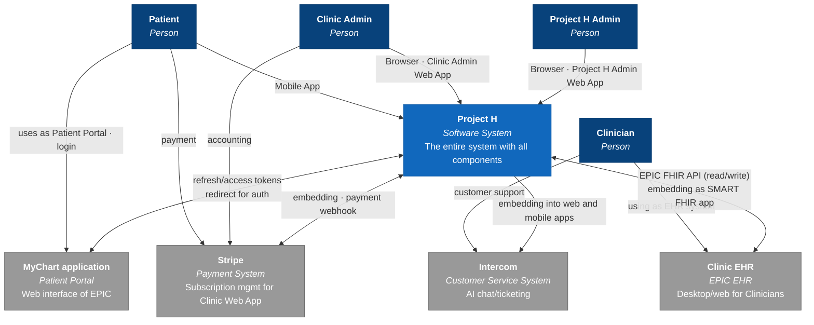

# C4 L1 — System Context

Project H sits at the centre of the diagram; the four persons and four external systems surround it.

Source: AVD 4.1 System Context View / Business Flow (Confluence page `420911679`). The architectural narrative around this diagram lives in [architecture overview — System Context view (C4 L1)](../overview.md#system-context-view-c4-l1) — that page lists the actors and systems with one-line role descriptions.

## Cross-references

- [Architecture overview — System Context view](../overview.md#system-context-view-c4-l1) — components in this view, prose form.
- [Integration points](../integration-points.md) — per-system contracts (auth, direction, cardinality, failure mode).
- [ADR-0001 MyChart as per-clinic SSO](../decisions/0001-mychart-as-per-clinic-sso.md) — the decision that determines the MyChart edge.
