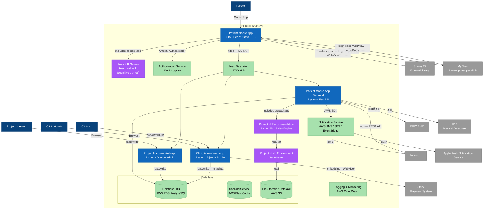

# C4 L2 — Container view

The single Project H box from the [System Context](c4-l1-system-context.md) opened up. Persons on top; external systems around the periphery; the Project H system boundary is the dashed area in the centre. **Interact with the diagram:** scroll-wheel zoom inside the frame, double-click to zoom in, drag to pan, use the on-canvas controls (top-left) to fit / reset.

Source: AVD 4.2 Container View (Confluence page `420911687`). Legend: dark-blue = Person, blue = Andersen-implemented container, purple = Project H-implemented library (D30 black-box), green = AWS managed service, grey = external system.

## Cross-references

- [Architecture overview — Container view](../overview.md#container-view-c4-l2) — components in this view, prose form (Andersen vs Project H vs cloud vs external split).
- [C4 L3 — Mobile App Backend](c4-l3-mobile-backend.md) — internal decomposition of the **Patient Mobile App Backend** container.
- [C4 L3 — Authorization Service](c4-l3-authorization-service.md) — internal decomposition of the **Authorization Service** (AWS Cognito glue).
- [Integration points](../integration-points.md) — per-external-system contract details (MyChart, FDB, Stripe, Intercom, AWS managed services).
