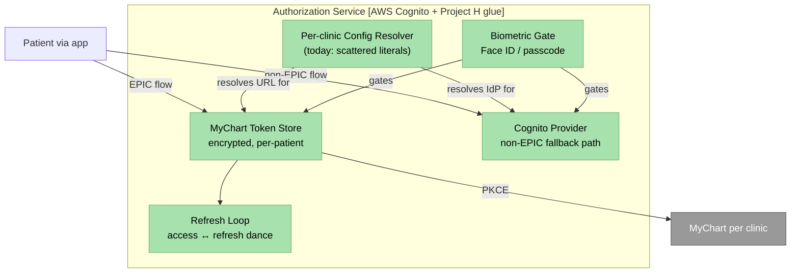

# C4 L3 — Authorization Service

Internal decomposition of the **Authorization Service** (AWS Cognito + Project H glue) container from the [C4 L2 view](c4-l2-container.md). This view exposes the **Per-clinic Config Resolver** as the extraction surface called out in the [per-clinic EPIC integration cost architectural assessment](../overview.md#architectural-assessments).

## Cross-references

- [Architecture overview — Component view (C4 L3) — Authorization Service](../overview.md#authorization-service-l3) — five components with per-component role descriptions.
- [Auth & Authorization module — Variations (EPIC vs non-EPIC)](../../modules/auth-authorization/variations.md) — the two paths through this service shown side by side.
- [ADR-0001 MyChart as per-clinic SSO](../decisions/0001-mychart-as-per-clinic-sso.md) — the decision the **MyChart Token Store** + **Per-clinic Config Resolver** operationalise.
- [Architecture overview — Per-clinic EPIC integration cost architectural assessment](../overview.md#architectural-assessments) — why the **Per-clinic Config Resolver** is the proposed extraction target.
