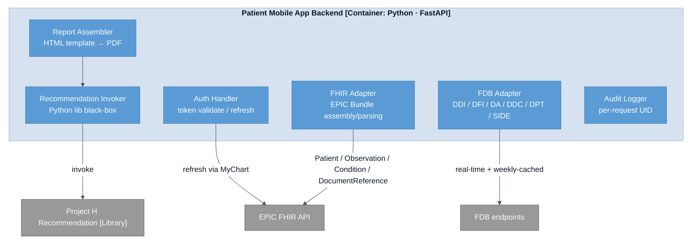

# C4 L3 — Patient Mobile App Backend

Internal decomposition of the **Patient Mobile App Backend** container from the [C4 L2 view](c4-l2-container.md). This is where the cross-system orchestration happens — EPIC FHIR exchange, FDB queries, report assembly, recommendation invocation.

## Cross-references

- [Architecture overview — Component view (C4 L3) — Mobile App Backend](../overview.md#patient-mobile-app-backend-l3) — six components with per-component role descriptions.
- [Data flow — Report to clinician](../data-flows/report-to-clinician.md) — how these six components compose at runtime to assemble the clinician PDF.
- [Architecture overview — CDSS Class I boundary architectural assessment](../overview.md#architectural-assessments) — why the **Recommendation Invoker** treating the library as a black box matters beyond engineering hygiene.
