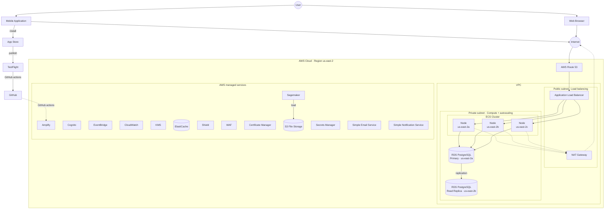

# Deployment view — MVP

AWS deployment for the MVP release. Region us-east-2 with Multi-AZ primary→read-replica replication; ECS Cluster with Docker workloads across three availability zones; AWS managed services rail on the right (Cognito, KMS, CloudWatch, ElastiCache, WAF, Shield, Certificate Manager, S3, SageMaker, Secrets Manager, SES, SNS). **Interact with the diagram:** scroll-wheel zoom, double-click, drag to pan, controls top-left.

Source: AVD 4.3 Deployment view (Confluence page `420911696`). RPO 5–10 min (continuous transaction-log backup); RTO 15–30 min (DB restore drill) per AVD §5.5.

## Cross-references

- [Architecture overview — Deployment view](../overview.md#deployment-view) — ten layers (DNS, Load Balancing, Compute, Networking, Database, ML & Storage, Monitoring, Security, CI/CD, Environments) with per-service one-liners.
- [Architecture overview — Operations](../overview.md#operations) — backup, DR, CI/CD, monitoring details.
- [Release coexistence](../release-coexistence.md) — references this view as MVP topology; a larger "final product" topology is post-MVP infrastructure.
