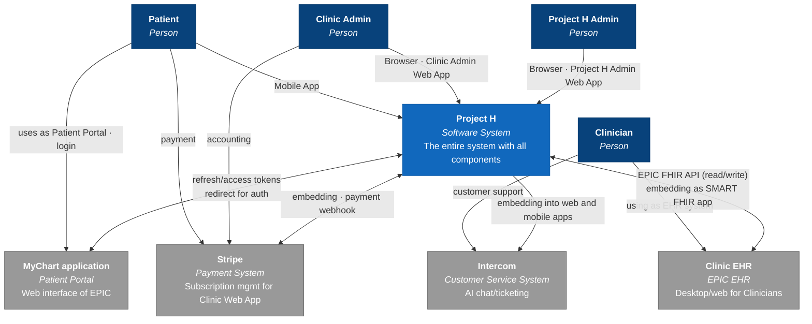
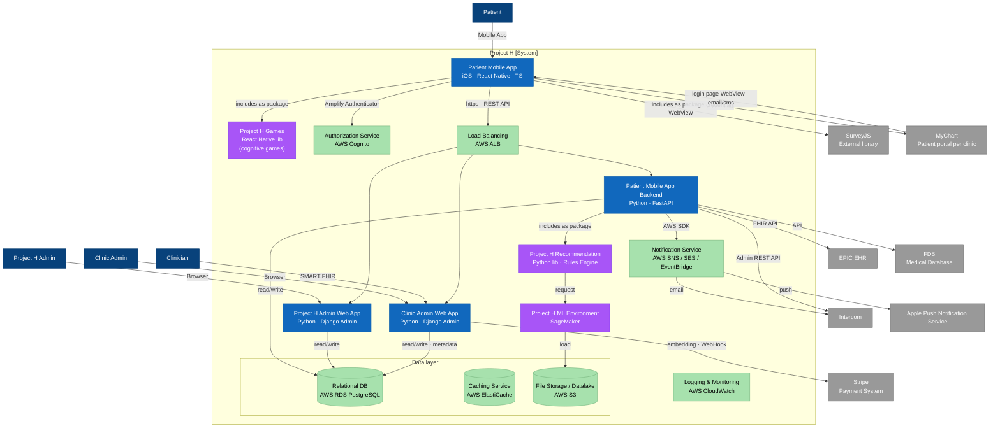
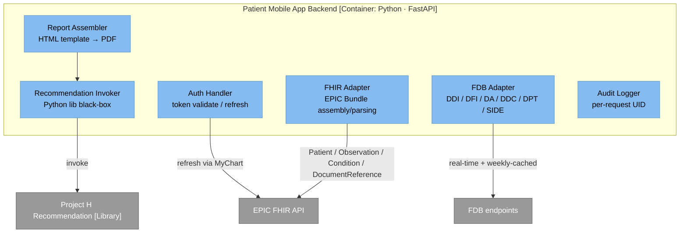
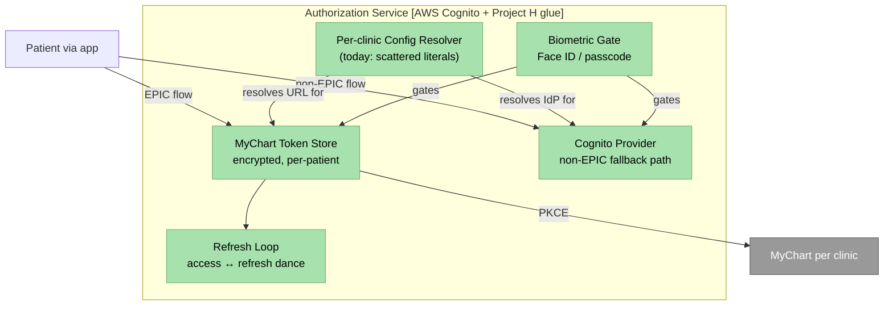
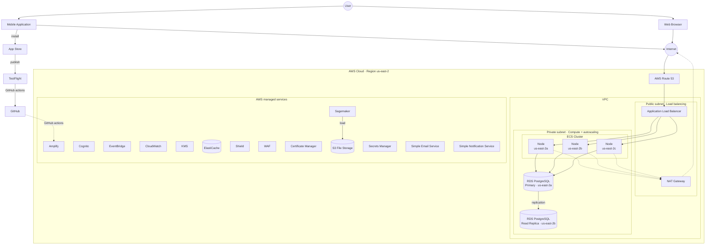

# Architecture overview

Authored using the AndersenLab standing architecture description template (legacy-system variant). Sections that don't apply to a presale/discovery substrate are re-labelled ("Key historical decisions" → "Key design decisions"; "Living risks" → "Living risks (identified in discovery)") and the rest of the template is kept intact.

## Scope

This document covers the **architecture of the MVP delivery** for Project H:

- **In scope.** Patient Mobile App (React Native, iOS-only), Clinic Web App (Python · Django Admin) with its EPIC plugin, Patient Mobile App Backend (Python · FastAPI), shared AWS HIPAA-eligible infrastructure, and integrations with EPIC (FHIR + MyChart SSO), FDB (medication knowledge), Stripe (clinic subscriptions), Intercom (frontend support), AWS managed services for notifications and observability.
- **Out of scope.** Kivira Admin App (Project H product-owner's own work, not part of Andersen's delivery). ML training in MVP (SageMaker is present but not exercised). Android (deferred — RN codebase is cross-platform, but only iOS ships in MVP). Non-EPIC EHRs other than the Cognito fallback path (Cerner, Oracle, etc.). FDA Class II+ functionality (the entire system is designed to remain Class I CDSS — see Architectural assessment below).

## Business context

Project H addresses an estimated 50–80 % mental-health misdiagnosis rate in US primary care, driven by short consult windows and scarce specialist support. Fewer than 35 % of primary-care clinicians rely on validated scoring instruments to guide treatment. Project H embeds validated questionnaires (intake + screener) and gamified cognitive assessments (WCST, ERT, Trail Making) into the clinician workflow via EPIC EHR integration; the clinician receives a structured PDF report assembled from the patient's answers plus FDB-coded treatment options, delivered via three FHIR resources into the EPIC inbound queue. Clinics monetise via CPT-code reimbursement and license Project H through per-seat Stripe subscriptions. The MVP target is 50 000 monthly active users within four months, at < $3 / patient / year without ML and < $5 / patient / year with ML.

## High-level description

Four sentences:

1. **Patient Mobile App + Backend** — RN/TS frontend (iOS only at MVP); FastAPI backend orchestrates EPIC FHIR exchange, FDB queries, recommendation invocation, and report generation.
2. **Clinic Web App** — Django Admin portal for clinic administrators, host of the EPIC SMART on FHIR invite-link plugin (registered in App Orchard).
3. **Clinician Report** — PDF generated server-side; delivered to the clinician's In Basket via three FHIR resources sent into EPIC; PDF download gated behind SMART FHIR auth.
4. **AWS HIPAA-eligible infrastructure** — ECS (Docker, autoscaling), RDS PostgreSQL Multi-AZ, S3, ElastiCache, CloudWatch, SNS / SES / APNS, Cognito (non-EPIC auth path), KMS, Secrets Manager, WAF, Shield.

## Key design decisions

Surfaced from the discovery-phase Confluence corpus (AVD §2.2 D1–D40, page `420911663`). The full set is listed in `context/project-h/project-h-doc-generation-brief.md`; the eight most cross-referenced ones are summarised here.

| D-code | Decision | Why |
| --- | --- | --- |
| D1 | Clinic Web App is a Python + Django Admin monolith; Patient Mobile App is React Native, iOS-only at MVP. | Single stack for the team to support post-handoff. |
| D3 | MyChart SSO **per clinic**, with Universal Link invite + 6-character backup code. | Avoids a Project H managed credential layer; clinician workflow stays inside EPIC. Full record in [ADR-0001](decisions/0001-mychart-as-per-clinic-sso.md). |
| D7 | SurveyJS as the questionnaire engine; backend JSON schemas + Survey Creator on the Kivira Admin side. | MIT licence, AWS Lambda-compatible, offline-capable; comparison table in AVD 4.6. |
| D9 | Access and refresh tokens stored encrypted on device; biometric gate on offline mode. | OWASP ASVS token-handling alignment; HIPAA at-rest encryption. |
| D15 | All cloud infrastructure on AWS HIPAA-eligible managed services. | BAA path via AWS reduces compliance perimeter. |
| D19 | Offline mode for intake / screener / follow-ups; local SQLite with asynchronous sync queue. | Patients without connectivity must not lose answers; queue + UUIDs handle reconnect dedup. |
| D23 | Only Observation, Condition, DocumentReference FHIR resources sent to EPIC. Recommendations live inside the PDF. | Keeps the system inside Class I CDSS. See Architectural assessment below. |
| D32 | Each clinic has its own EPIC / MyChart instance — per-clinic integration subprojects. | Reality of US healthcare estate. See Architectural assessment below. |

Each row is a candidate for a future ADR. Only ADR-0001 (D3) is authored in this sample; the rest are listed as "to be authored" in [decisions/](decisions/0001-mychart-as-per-clinic-sso.md).

## Living risks (identified in discovery)

| R-code | Risk | Priority | Mitigation surface |
| --- | --- | --- | --- |
| R2 | EPIC certification (App Orchard) delays MVP launch | High | Start App Orchard process in parallel with development; sandbox setup as a week-1 task. See ADR-0001 Consequences. |
| R3 | Per-clinic EPIC integration cost scales linearly with clinic count | High | See architectural assessment below — proposed config-store extraction. |
| R5 | Compliance scope drift (HIPAA + SOC 2 + OWASP) during dev | High | Dedicated Compliance Engineer; documented audit trail; quarterly internal review. |
| R6 | Healthcare-standards adherence at the code level | High | Use of vetted libraries; engagement with EPIC's App Orchard review. |
| R1 | FDB integration (NDA + sandbox access) blocked | Medium | Resolve NDA in week 1; sandbox endpoints staged for dev/stage. |
| R4 | External-system failure (EPIC / FDB / Stripe / Intercom) | Medium | Retry with exponential backoff; circuit-breaker pattern; failed-call logs reviewed weekly. |
| R11 | Payment-integration errors (Stripe) | Medium | Stripe webhooks signed; idempotency keys on every POST. |
| R8 | Patient data loss in DB | Low | RDS automated backups + Multi-AZ; restore-drill on cadence. |

Each entry has an *Owner: TBD* in the source — assigning owners is a Stage-4c Tech Lead validation task per TA §4.

## Architectural drivers

- **Business goals.** 50 000 MAUs in 4 months; < $3 / patient / year without ML; CPT-code-based clinic ROI.
- **Major features.** Three-app split + clinician PDF report; offline-capable assessments; per-clinic EPIC integration.
- **Design constraints (CT-1 through CT-8 from AVD §3.2, page `420911668`).**
    - CT-1 — Open-source + custom only; third-party dependencies require explicit decisions.
    - CT-2 — Cross-platform RN; MVP iOS-only.
    - CT-3 — Python backend (Project H Admin App context).
    - CT-4 — Designed within HIPAA at-rest + in-transit encryption.
    - CT-5 — US healthcare standards (HIPAA / OWASP ASVS / SOC 2 Type II / WCAG 2.1 AA).
    - CT-6 — Up to 50 000 registered patients per clinic; horizontal scaling.
    - CT-7 — Black-box customer components (recommendation engine, cognitive games) integrate via stable interfaces.
    - CT-8 — Certified US data store (RDS in us-east-2).

## Quality attribute scenarios

Pulled from Vision & Scope `Key non-functional requirements` (Confluence page `420926444`).

- **Security.** RBAC; OAuth2 + PKCE for patient auth (via MyChart); tamper-resistant audit logs; secrets in AWS Secrets Manager.
- **Availability and reliability.** Multi-AZ RDS; ECS autoscaling; offline fallback for assessments. **RPO 5–10 min** (continuous transaction-log backup); **RTO 15–30 min** (DB restore drill cadence, AVD §5.5).
- **Performance.** Response-time target TBD (the spec marks this); autoscaling handles peaks.
- **Compliance.** HIPAA 10+ year retention; SOC 2 Type II audit posture from year 1; OWASP ASVS L2; WCAG 2.1 AA for both Patient Mobile App and Clinic Web App.
- **Interoperability.** Bidirectional FHIR / HL7 exchange with EPIC; FDB integration via REST.

## System Context view (C4 L1)

## Container view (C4 L2)

## Component view (C4 L3 — selected containers)

Per TA §2, C4 L3 is applied **selectively** — only to containers whose internal structure is non-trivial. Two containers are decomposed at L3 here; the rest are intentionally skipped (rationale below).

### Patient Mobile App Backend (L3)

Why L3 here: the Backend is where cross-system orchestration happens. Without L3, a reader cannot see that the report flow has six internal components and that the Recommendation Invoker treats the recommendation library as a black box (D30).

### Authorization Service (L3)

Why L3 here: this view exposes the **Per-clinic Config Resolver** as the extraction surface called out in the Architectural assessment below. It also disambiguates EPIC vs non-EPIC paths at the component level — see [variations](../modules/auth-authorization/variations.md).

### L3 deferred — containers not decomposed

- **Project H Recommendation, Games, ML Environment** — single-purpose Project H libraries. The L2 container view already says what the reader needs.
- **Clinic Admin Web App, Project H Admin Web App** — Django Admin scaffolds. L3 would re-derive the Django admin model graph; the reader is better served by [`schema/`](../schema/overview.md).
- **SurveyJS** — third-party library. Outside the decomposition scope.

The explicit skip is itself a methodology beat (TA §2: *"we use C4's levels **selectively**"*).

## Deployment view

This is the MVP deployment. A larger "final product" topology (with full HW provisioning, additional managed services) is referenced in [release-coexistence](release-coexistence.md) as post-MVP infrastructure.

## Decision view

Two ADRs are authored as the canonical examples; further D-codes from the source remain candidates.

- **[ADR-0001](decisions/0001-mychart-as-per-clinic-sso.md)** — *retrospective*. MyChart as per-clinic SSO with Universal Links + backup codes (D3). Captures the rationale recovered from the Confluence comparison table.
- **[ADR-0002](decisions/0002-mermaid-for-inline-diagrams.md)** — *forward*. Mermaid as the default for all inline diagrams in this sample (TA §2 / §7 diagram-tool decision rule). A methodology decision made while authoring the sample.

A real engagement would add ADRs for D7 (SurveyJS choice), D15 (AWS HIPAA-eligible managed services adoption), D23 (FHIR-resource selection that preserves Class I CDSS — see below), D30 (recommendation as black-box library), D32 (per-clinic EPIC integration model).

## Operations

- **Backup.** RDS automated daily snapshots, 1–35-day retention, continuous transaction-log replay. Drill cadence: monthly restore into a sandbox.
- **DR.** Multi-AZ primary→read-replica; ALB health checks; ECS autoscaling. RPO 5–10 min; RTO 15–30 min (AVD §5.5).
- **CI/CD.** GitHub Actions; mobile builds via TestFlight; infrastructure-as-Code via Terraform or Pulumi (final choice TBD in week 1 of implementation).
- **Monitoring and observability.** AWS CloudWatch for metrics and logs. Every request carries a unique correlation ID; logs are tamper-resistant (CloudWatch Logs immutable archive).
- **Per-request audit.** Tamper-resistant audit log of patient-data accesses; reviewed quarterly by the Compliance Engineer.

---

## Architectural assessments

Two embedded notes calling out weak spots / refactor surfaces discovered during authoring (Prompt §3 item 7 — architect-level analysis embedded in documentation).

> [!note] Architectural assessment — Per-clinic EPIC integration cost
>
> The decision in D32 (per-clinic EPIC integration) combined with the Living Risk R3 (cost scales linearly with clinic count) means MVP launch with *N* clinics is not a constant-cost activity. Each new clinic implies a new App Orchard configuration entry, OAuth2 redirect URI registration, FHIR endpoint base, sandbox setup, and integration-test pass.
>
> **Architectural observation.** The integration layer is not abstracted enough in the current design to absorb the per-clinic delta. OAuth2 redirect URIs, App Orchard client IDs, FHIR endpoint bases, and sandbox-vs-prod flags are scattered as literals across configuration. The L3 view of the Authorization Service (above) calls out the **Per-clinic Config Resolver** as the natural extraction point.
>
> **Proposed surface.** Extract a per-clinic configuration object — `{clinic_id, app_orchard_client_id, fhir_endpoint_base, redirect_uri, environment}` — into a single configuration store (DynamoDB or a Postgres `clinic_configs` table). Both the Authorization Service and the Patient Mobile App Backend read from this store. New-clinic onboarding becomes O(1) configuration writes, not O(N) code touches. This is a refactor, not a redesign — but the document should call it out before code is written, not after.

> [!note] Architectural assessment — CDSS Class I boundary preserved by report shape
>
> Decision D23 — only Observation, Condition, and DocumentReference flow outbound to EPIC — has a load-bearing compliance consequence beyond its technical framing. By keeping the diagnostic and treatment recommendations *inside* the PDF (via DocumentReference link), the system stays clearly within Class I CDSS territory. The clinician downloads, reviews, and decides; the system does not "speak" structured recommendations through FHIR.
>
> **Where the boundary breaks.** If a future feature were to push structured treatment data via `MedicationRequest` or `CarePlan` FHIR resources, that would push the system into Class II territory and trigger a separate FDA premarket process. The line is invisible in the current architecture and easy to cross unintentionally.
>
> **Proposed surface.** Add a `> [!warning]` precondition flag to any future user story that proposes structured recommendation output to EPIC. The FDA-classification question must precede the engineering question. A future ADR ("CDSS Class I boundary policy") would lock this guardrail formally.

---

## Open questions

- **App Orchard approval timeline** — does it block MVP launch, or run in parallel with development? *Owner:* Architect + Compliance Engineer. *Outcome:* week-1 task in the implementation engagement.
- **HIPAA consent versioning** — current docs specify "fixed content in MVP", but no rule for re-prompt-on-bump. *Owner:* Compliance Engineer. *Outcome:* policy decision before consent text changes post-launch.
- **Biometric setup skip policy** — US-1.6 says deferrable once; no Living Risk discusses repeated skips. *Owner:* Tech Lead. *Outcome:* edge-case enumeration during implementation.
- **Andersen→Project H handoff on the Admin App** — documentation-only, or includes a runbook? *Owner:* Project Manager. *Outcome:* scope confirmation before development starts.
- **Patient-profile mutability per EPIC re-auth** — snapshot-immutable or mutable in place? Implications for audit logs and HIPAA right-to-access. *Owner:* Compliance Engineer + Architect. *Outcome:* design spike in week 1.
