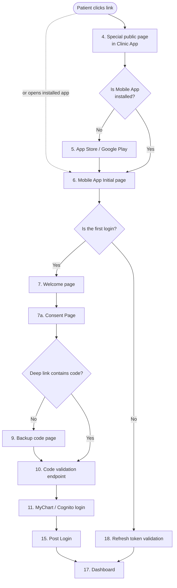
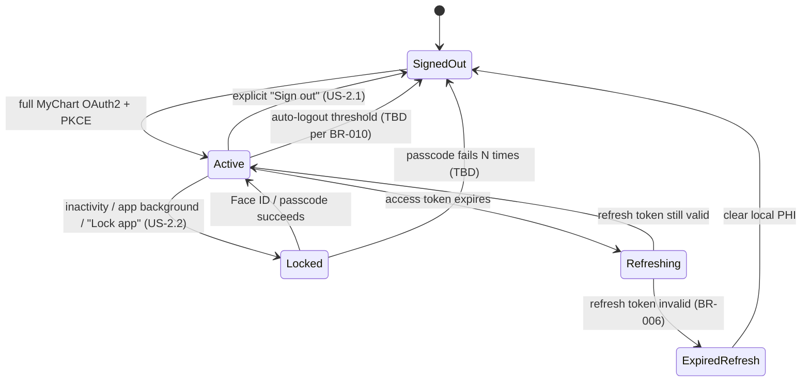

# Auth & Authorization — overview

The patient sign-up / sign-in module. Spans MyChart SMART OAuth2 (EPIC clinics) and Cognito + Amplify Authenticator (non-EPIC clinics). The module's surface includes the invite-link / backup-code validation, consent collection, MyChart authentication, biometric setup, and dashboard handoff.

## Purpose and scope

The module's job is to:

1. Validate the patient's right to onboard (invite link or backup code → clinic identification).
2. Collect consents before any PHI touches a Project H system.
3. Authenticate the patient against the correct identity provider (MyChart for EPIC clinics; Cognito for non-EPIC).
4. Store the resulting access and refresh tokens securely (D9).
5. Gate access to PHI behind biometric / passcode (BR-008).
6. Hand the patient off to the dashboard (where intake / screener / cognitive games live in subsequent modules).

The module **does not** own report assembly (see [data-flows/report-to-clinician](../../architecture/data-flows/report-to-clinician.md)), questionnaire rendering (Epic-2), or the patient-profile data model (see [schema/tables/patient-profile](../../schema/tables/patient-profile.md)).

## Key entities

Names below are *conceptual* — actual table / column names are locked in [`../../schema/`](../../schema/overview.md).

- **`Patient`** — the human user. Identified by `patient_id` (Project H-internal UUID) and `epic_patient_id` (where the clinic is EPIC).
- **`InviteToken`** — single-use token embedded in the Universal Link. Carries the clinic ID and patient ID; expires.
- **`BackupCode`** — 6-character (length TBD) fallback for invite-link failure. Single-use, retry-limited.
- **`Consent`** — per-patient acceptance of a specific consent text version. See `consent_version` in [patient-profile](../../schema/tables/patient-profile.md).
- **`MyChartCredentials`** — encrypted opaque handle to the MyChart OAuth2 access + refresh tokens.
- **`BiometricRegistration`** — local-only registration of Face ID / passcode on the device.
- **`SessionToken`, `RefreshToken`** — the lifecycle of these is the state diagram below.

## Primary workflows

Three workflows live in this module. The first (first-time onboarding) is the dominant one and is rendered as a flowchart from the source AVD 4.5 diagram.

### 1. First-time onboarding

The end-to-end onboarding flow. See [`../../architecture/data-flows/patient-onboarding.md`](../../architecture/data-flows/patient-onboarding.md) for the full step-by-step prose; the flowchart is reproduced inline below for navigability.

(For the full 22-step version with all 14 decision branches, see [`../../architecture/data-flows/patient-onboarding.md`](../../architecture/data-flows/patient-onboarding.md).)

### 2. Returning login

On subsequent app opens: refresh-token validation → biometric check → token refresh via backend → dashboard. The dance is summarised on the right side of the flowchart above (steps 18 → 22a → 17).

### 3. Logout & auto-logout (Epic-1 F2 US-2.1, US-2.2)

Two flavours:

- **"Lock app"** — fast re-entry. Closes the PHI surface, but keeps MyChart tokens valid. Re-entry requires Face ID / passcode.
- **"Sign out"** — full logout. Revokes MyChart tokens, clears local PHI, the next launch requires full MyChart OAuth.

Auto-logout fires after configured inactivity (threshold TBD per BR-010).

## Session lifecycle (state diagram)

The state machine that BR-005 through BR-010 collectively describe. Demonstrates TA §2 UML "State" coverage.

Five reachable states; two `(TBD)` transitions whose thresholds are open questions cross-referenced in [`business-rules.md`](business-rules.md).

## Integration points

- **MyChart per clinic** — see [`../../architecture/integration-points.md#epic-ehr--mychart`](../../architecture/integration-points.md#epic-ehr--mychart) for the contract. SMART on FHIR OAuth2 + PKCE.
- **Cognito (non-EPIC fallback)** — see [`variations.md`](variations.md). AWS Cognito + Amplify Authenticator.
- **Project H Patient Mobile App Backend** — owns token storage, invite-token validation, consent capture. Internal HTTP API.
- **Project H Patient Profile** — first-login data fetch from EPIC populates this composite. See [`../../schema/tables/patient-profile.md`](../../schema/tables/patient-profile.md).

## Cross-references

- [`../../architecture/overview.md` — §4.5 Patient Auth Flow](../../architecture/overview.md) — the architectural anchor.
- [`../../architecture/data-flows/patient-onboarding.md`](../../architecture/data-flows/patient-onboarding.md) — full step-by-step narrative + flowchart.
- [`../../architecture/decisions/0001-mychart-as-per-clinic-sso.md`](../../architecture/decisions/0001-mychart-as-per-clinic-sso.md) — the canonical decision.
- [`../../schema/tables/patient-profile.md`](../../schema/tables/patient-profile.md) — token references, consent metadata, biometric flag.
- [`business-rules.md`](business-rules.md) — BR-001 through BR-010+.
- [`variations.md`](variations.md) — EPIC vs non-EPIC fork.

## Open questions

- **Inactivity threshold for auto-logout (BR-010).** Currently TBD in the source. *Owner:* Compliance Engineer (HIPAA implications) + Tech Lead. *Outcome:* policy decision before MVP launch.
- **MyChart URL resolution after local-storage wipe.** What happens when both local store is cleared *and* the refresh token is invalid? Currently the backend lookup via `epic_patient_id` requires an authenticated call — chicken-and-egg risk. *Owner:* Tech Lead. *Outcome:* design spike in week 1.
- **Biometric setup permanent-skip policy.** US-1.6 says deferrable once; what if a patient repeatedly skips by signing out and signing in? *Owner:* UX + Compliance Engineer. *Outcome:* edge-case spec.
- **Audit trail of biometric failures.** Is N consecutive passcode failures (currently TBD) logged for the patient or for clinic admin review? *Owner:* Compliance Engineer. *Outcome:* policy decision.
