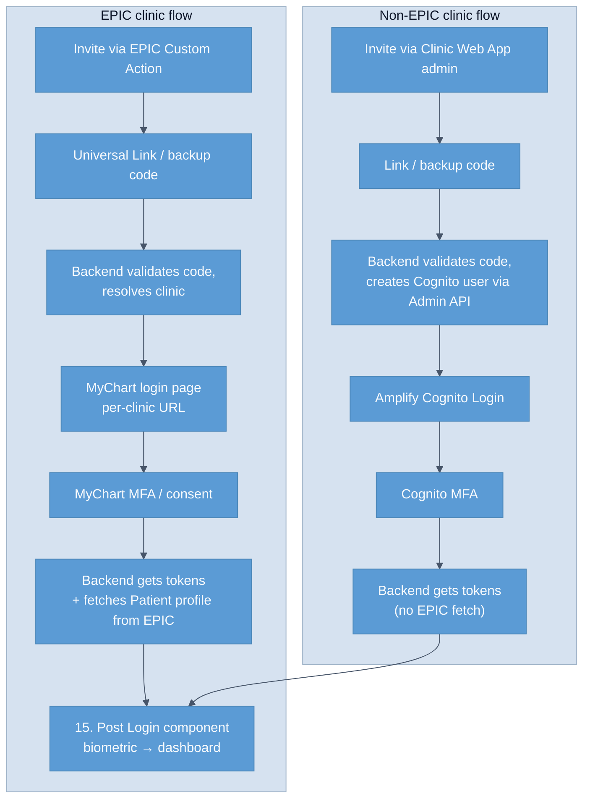

# Auth & Authorization — variations (EPIC vs non-EPIC)

The module supports two parallel authentication paths — **EPIC clinic** (MyChart SMART OAuth2 + PKCE) and **non-EPIC clinic** (AWS Cognito + Amplify Authenticator) — that diverge significantly before converging at the Post-Login component. This doc walks the fork in four questions: current state, where the paths coexist, known divergences, and migration trajectory.

## 1. What is the current state?

Two parallel paths through the same module:

| Stage | EPIC clinic path | Non-EPIC clinic path |
| --- | --- | --- |
| Identity provider | MyChart (per-clinic instance) | AWS Cognito (single global) |
| Auth protocol | SMART on FHIR OAuth2 + PKCE | OAuth2 via Amplify Authenticator |
| Token store | `mychart_token_ref` in `patient_profile` | `cognito_user_id` + Cognito-internal token store |
| First-login data fetch | EPIC FHIR API → 15 resources, prefills patient profile (BR-007) | None — Cognito user profile + Project H-side `patient_profile` only |
| Report delivery (post-auth) | Three FHIR resources into EPIC Inbound Queue | Out of scope for MVP — non-EPIC clinics have no report-delivery flow yet |
| Invite mechanism | Custom Action in EPIC + SMART FHIR plugin (registered in App Orchard) | Clinic Web App admin page generates link + code directly |

The split is visible in the [patient-onboarding flowchart](../../architecture/data-flows/patient-onboarding.md) at three decision diamonds (steps 10, 15, post-15) — wherever "Is EPIC flow?" is asked.

A diagram of the parallel paths:

## 2. Where does coexistence happen?

Three coexistence surfaces:

- **The Backend Code Validation Endpoint** (step 10 in the onboarding flow). This is the single entry point that returns `login_flow_type` along with the OAuth URL. Every downstream component branches on this value. If the value is wrong, the wrong identity provider is launched.
- **The `patient_profile` schema.** `epic_patient_id` is nullable (non-EPIC patients don't have one); `cognito_user_id` is nullable (EPIC patients don't have one); `mychart_token_ref` is nullable for non-EPIC. The columns are intentionally nullable rather than splitting into per-flow tables.
- **The Authorization Service (C4 L3 view in [architecture overview](../../architecture/overview.md#authorization-service-l3)).** Same service routes both flows; the `Per-clinic Config Resolver` component holds the EPIC vs Cognito decision per clinic.

## 3. What are the known divergences?

- **EPIC path triggers a patient-data prefill from EPIC FHIR** (step 15b in the onboarding flow). Non-EPIC path skips this step — the Project H side knows only what was captured at signup (which is currently very little; see [open questions](#open-questions)).
- **Offline-mode token refresh on the EPIC path requires re-resolving the per-clinic MyChart URL** if local storage was cleared. The non-EPIC path uses a single global Cognito endpoint, so URL resolution is trivial. The chicken-and-egg risk in the EPIC path (also called out in [overview](overview.md) and [business-rules](business-rules.md) BR-006) does not apply to non-EPIC.
- **Report exchange (Observation / Condition / DocumentReference outbound to EPIC) applies only to EPIC clinics.** Non-EPIC clinics have no analog in MVP — see the [release-coexistence doc](../../architecture/release-coexistence.md) for what would change in subsequent releases.
- **Invite mechanism shape differs.** EPIC path goes through the Custom Action button in the clinician's EPIC workflow; non-EPIC path goes through a Clinic Web App admin page. The clinician UX is therefore significantly different between the two paths.

## 4. What is the migration trajectory?

> [!warning]
> The non-EPIC path is positioned as a **fallback / parallel path** in the AVD, not as a primary path. The architectural intent reading the source corpus is that MVP launches with one or more EPIC clinics first, with the non-EPIC support exercised but not the primary entry. This is the architect's read; the docs do not explicitly say "EPIC is canonical, non-EPIC is fallback". Workshop topic with Project H leadership in week 1.

If the non-EPIC path graduates to a primary path (i.e., Project H sells to clinics that have actively chosen *not* to use EPIC), several gaps would need to close:

- **Report-delivery flow** — non-EPIC clinics need a way to receive the clinician report. Options: PDF email, a clinic-side dashboard, integration with their own EHR (Cerner / Oracle / other). Each is a separate ADR.
- **Patient-data sources** — without EPIC FHIR, the patient profile is patient-self-reported only. Either accept that or design a patient-portal data-capture flow.
- **CDSS Class I boundary preservation** — same constraint applies (recommendations stay inside the PDF; no structured FHIR push of recommendations). Easy to maintain in MVP shape; revisit when non-EPIC report delivery is designed.

## Cross-references

- [`overview.md`](overview.md) — primary workflows, the flowchart, the state diagram.
- [`business-rules.md`](business-rules.md) — BR-005 / BR-006 / BR-007 carry "Variations" columns calling out the EPIC vs non-EPIC differences.
- [`../../architecture/decisions/0001-mychart-as-per-clinic-sso.md`](../../architecture/decisions/0001-mychart-as-per-clinic-sso.md) — the EPIC-path decision; the non-EPIC path is a derived fallback.
- [`../../architecture/release-coexistence.md`](../../architecture/release-coexistence.md) — cross-cutting release coexistence.

## Open questions

- **Is the non-EPIC path canonical or fallback?** Architect's reading of the source is "fallback"; the docs don't explicitly say so. *Owner:* Project H product. *Outcome:* explicit policy statement in week 1.
- **For non-EPIC clinics, where does the clinician receive the report?** No flow defined in MVP. *Owner:* Project H product + Architect. *Outcome:* design decision before any non-EPIC clinic onboards in production.
- **Token store unification.** Should `mychart_tokens` and Cognito token storage live in a single `patient_tokens` table with a provider discriminator, or stay separate? *Owner:* Tech Lead + Architect. *Outcome:* DDL design decision.
- **Per-clinic feature flag for the choice.** Today the EPIC vs non-EPIC choice is implicit in clinic configuration. Should it be an explicit per-clinic flag with `null` (= not decided yet) as a valid state? *Owner:* Architect. *Outcome:* design pass.
